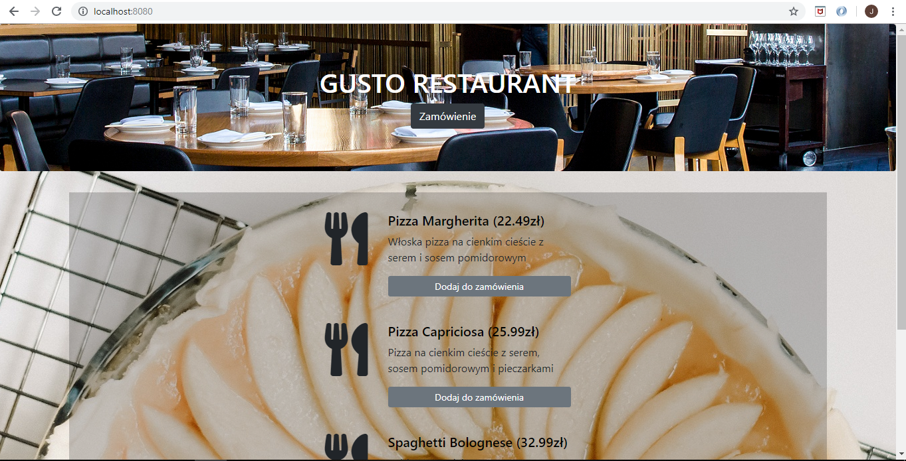
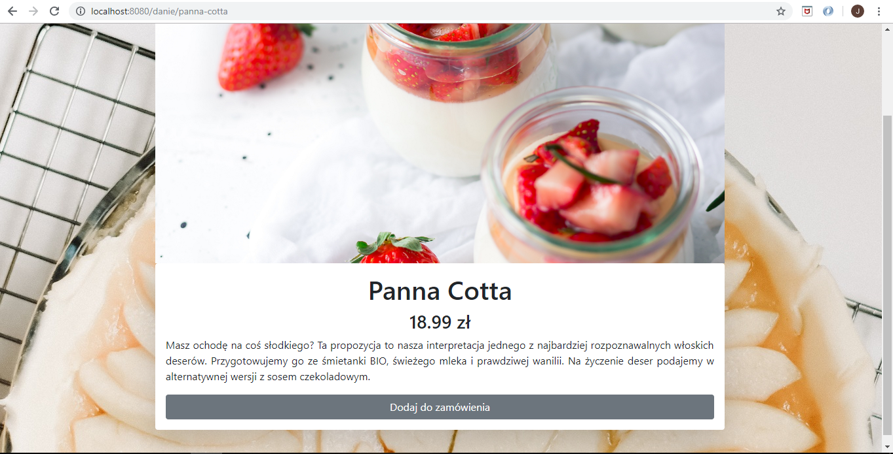
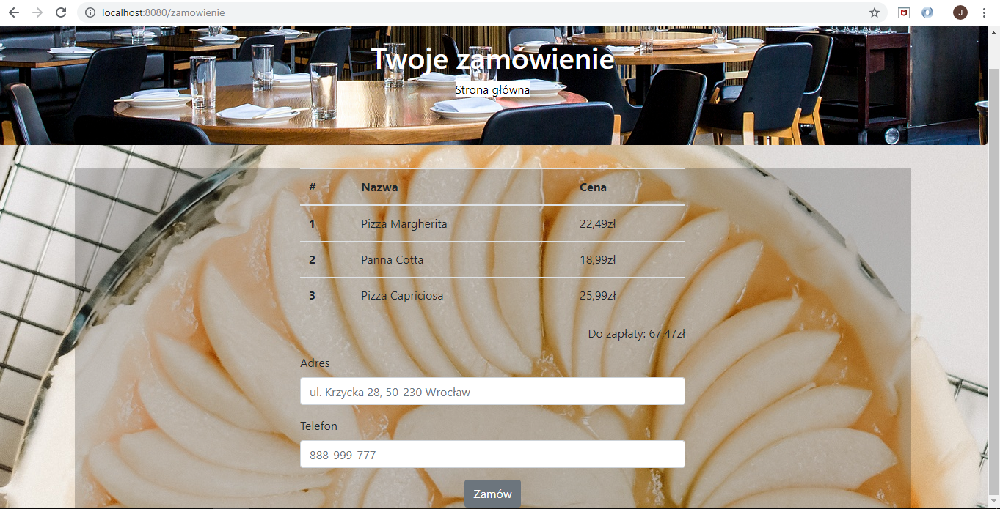
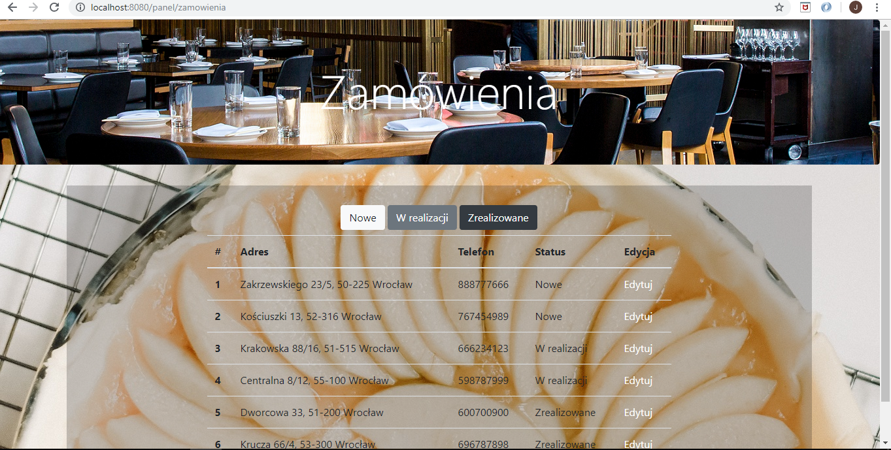
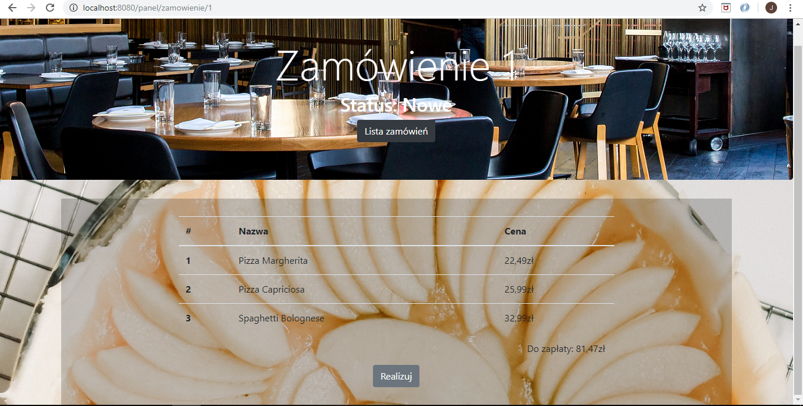

# FoodApp
> An internet service to order food, created with Spring Boot, Spring MVC, Spring Data, Thymeleaf, Bootstrap.

## Table of contents
* [General info](#general-info)
* [Screenshots](#screenshots)
* [Technologies](#technologies)
* [Status](#status)

## General info
The application was created to improve knowledge through the training.

### Available:

#### for customer

- the main page contains a list of all available dishes on the menu
- after clicking the name of the dish on the main page, the customer is redirected to the page with a detail description of the food and its picture,
- the customer can add the dish to the order using the button located next to each item in the menu on the home page or button on the dish's detail page,
- there is a link to the order summary with the total price to pay on the top panel. There is also form where the customer gives his address and telephone number. 
After clicking the button under the form, the order is saved to the database with the status "New",

#### for owner
- all orders are available in the panel under the following address "/panel/orders". The panel has three buttons that filter the list of orders by status - NEW, IN_PROGRESS or COMPLETE,
- after clicking on the selected order, we are transferred to the detail card, where we can find a list of ordered items for the order. In addition, there is a button on the order card that allows to change the order status from NEW to IN_PROGRESS or from IN_PROGRESS to COMPLETE.

## Screenshots

## Technologies
* JDK 9
* Maven 3.5.4
* Spring Boot 2.1.2
* Spring Data
* Spring MVC
* Thymeleaf
* Bootstrap

## Status
Project is: _finished_
